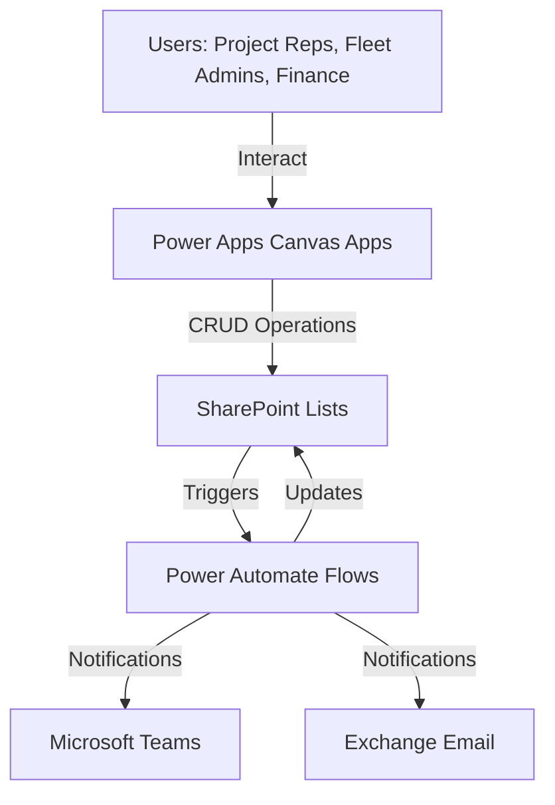
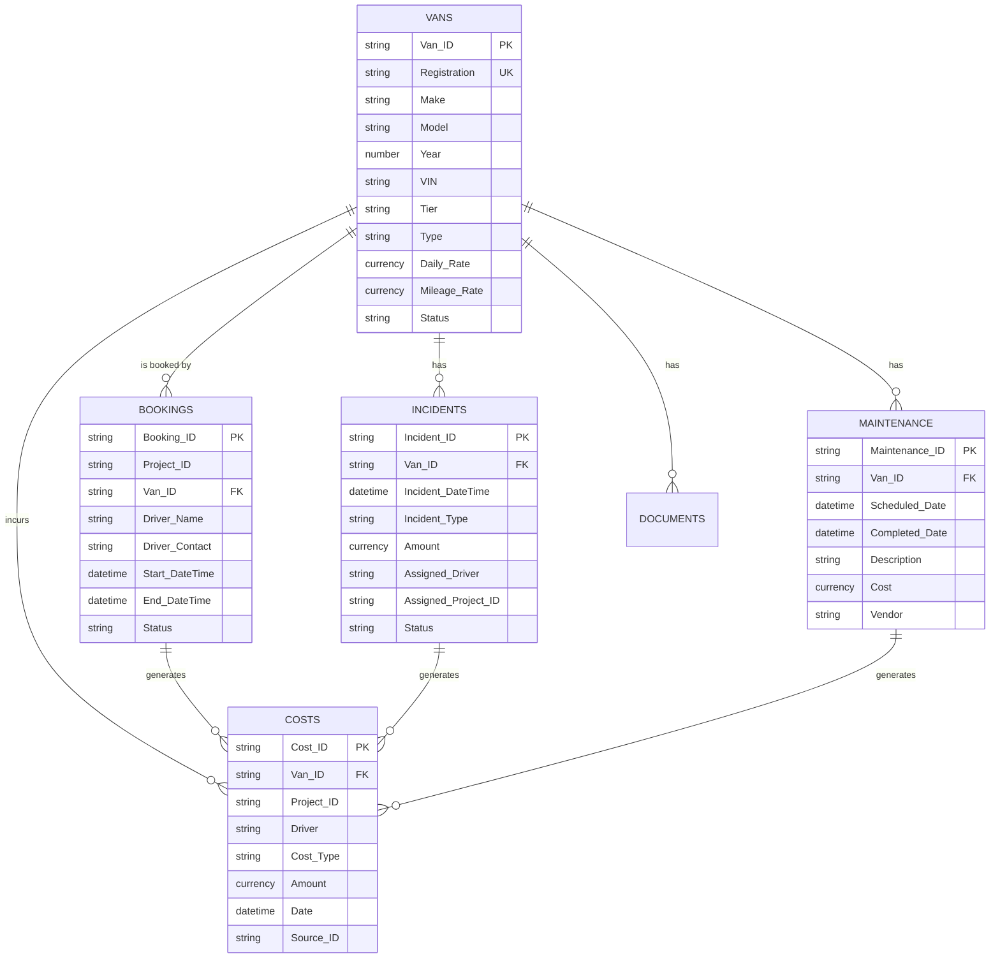
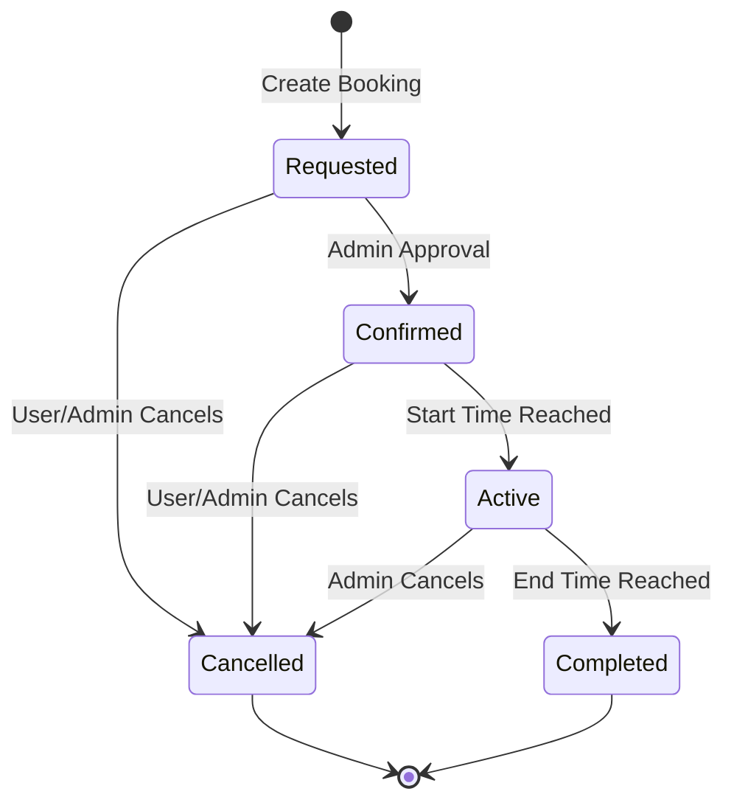
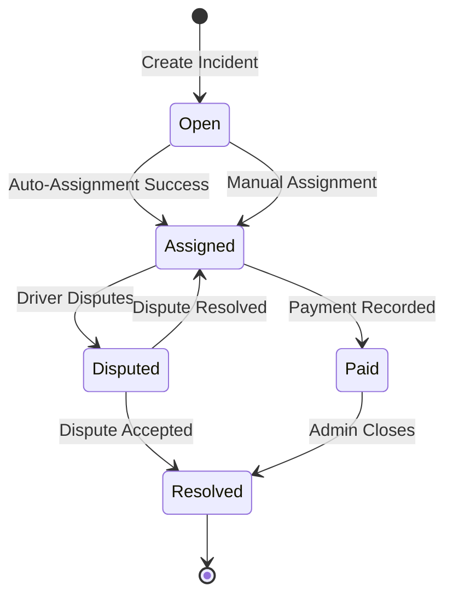
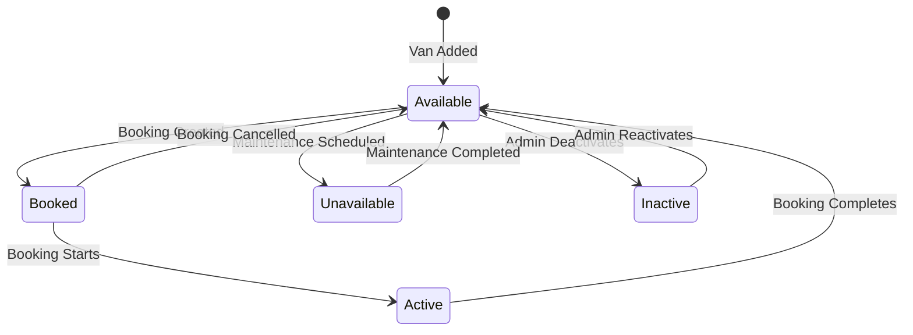

# Design Document: Van Booking & Fleet Management System

## Overview

The Van Booking & Fleet Management System (VBMS) is a cloud-based solution built on the Microsoft 365 platform that modernizes fleet management for 8 field Project Representatives sharing a pool of vans. The system architecture leverages SharePoint Lists for data persistence, Power Apps for user interfaces, Power Automate for workflow automation, and Microsoft 365 for authentication and notifications.

The design follows a layered architecture:
- **Data Layer**: SharePoint Lists with enforced relationships and validation
- **Business Logic Layer**: Power Automate flows handling state transitions, validations, and notifications
- **Presentation Layer**: Power Apps canvas applications providing role-based interfaces
- **Integration Layer**: Microsoft Graph API and SharePoint REST API for cross-service communication

Key design principles:
- **Zero double-bookings**: Conflict detection enforced at the data layer
- **Complete audit trail**: SharePoint versioning + custom audit list
- **Event-driven architecture**: Power Automate flows triggered by data changes
- **Role-based security**: SharePoint permissions + Power Apps role checks
- **Mobile-first**: Responsive Power Apps design for field use

## Architecture

### System Context



### Data Architecture

The system uses five primary SharePoint Lists with enforced relationships:

**Vans List**:
- Van_ID (Text, Primary Key, Indexed)
- Registration (Text, Unique, Indexed)
- Make (Text)
- Model (Text)
- Year (Number)
- VIN (Text)
- Tier (Choice: Standard, Premium, Specialized)
- Type (Choice: Cargo, Passenger, Refrigerated)
- Daily_Rate (Currency)
- Mileage_Rate (Currency)
- Status (Choice: Available, Booked, Active, Unavailable, Inactive)
- Configuration (Multi-line Text)
- Accessories (Multi-line Text)

**Documents Library** (linked to Vans):
- Van_ID (Lookup to Vans)
- Document_Type (Choice: Insurance, Registration, Inspection)
- Expiry_Date (Date)
- File (Attachment)

**Bookings List**:
- Booking_ID (Auto-generated, Primary Key)
- Project_ID (Text, 5 digits, Indexed)
- Van_ID (Lookup to Vans, Indexed)
- Driver_Name (Text)
- Driver_Contact (Text)
- Start_DateTime (DateTime, Indexed)
- End_DateTime (DateTime, Indexed)
- Status (Choice: Requested, Confirmed, Active, Completed, Cancelled)
- Created_By (Person)
- Created_Date (DateTime)
- Modified_By (Person)
- Modified_Date (DateTime)

**Maintenance List**:
- Maintenance_ID (Auto-generated, Primary Key)
- Van_ID (Lookup to Vans)
- Scheduled_Date (DateTime)
- Completed_Date (DateTime)
- Description (Multi-line Text)
- Cost (Currency)
- Vendor (Text)
- Maintenance_Type (Choice: Date-based, Usage-based)
- Attachments (Attachment)

**Incidents List**:
- Incident_ID (Auto-generated, Primary Key)
- Van_ID (Lookup to Vans)
- Incident_DateTime (DateTime, Indexed)
- Incident_Type (Choice: Fine, Accident, Damage, Other)
- Description (Multi-line Text)
- Amount (Currency)
- Assigned_Driver (Text)
- Assigned_Project_ID (Text)
- Status (Choice: Open, Assigned, Paid, Resolved, Disputed)
- Attachments (Attachment)

**Costs List**:
- Cost_ID (Auto-generated, Primary Key)
- Van_ID (Lookup to Vans)
- Project_ID (Text, Indexed)
- Driver (Text)
- Cost_Type (Choice: Fuel, Tolls, Maintenance, Fine)
- Amount (Currency)
- Date (DateTime)
- Description (Multi-line Text)
- Source_ID (Text) // Links to Maintenance_ID or Incident_ID

**Audit_Trail List**:
- Audit_ID (Auto-generated, Primary Key)
- Entity_Type (Choice: Van, Booking, Maintenance, Incident, Cost)
- Entity_ID (Text, Indexed)
- Action (Choice: Create, Update, Delete, Status_Change)
- User (Person)
- Timestamp (DateTime)
- Changed_Fields (Multi-line Text, JSON format)
- Old_Values (Multi-line Text, JSON format)
- New_Values (Multi-line Text, JSON format)

### Application Architecture

**Power Apps Canvas Applications**:

1. **Booking Management App**:
   - Create Booking Screen: Form with van selector, date/time pickers, project ID input
   - My Bookings Screen: Gallery of user's bookings with edit/cancel actions
   - Booking Details Screen: Full booking information with audit history
   - Conflict detection: Real-time validation against existing bookings

2. **Calendar View App**:
   - Calendar Control: Custom gallery showing daily/weekly/monthly views
   - Filter Panel: Dropdowns for tier, type, rep, project, status
   - Color-coded tiles: Visual status indicators
   - Click-through navigation: To booking details and vehicle profiles

3. **Fleet Management App** (Admin only):
   - Van Master Screen: Gallery with CRUD operations
   - Vehicle Profile Screen: Tabs for details, documents, bookings, maintenance, incidents
   - Maintenance Scheduler: Calendar view with maintenance records
   - Incident Logger: Form for recording fines and incidents

4. **Reporting App**:
   - Report Selection Screen: Buttons for different report types
   - Report Viewer: Data table with filters and sorting
   - Export Function: Download to Excel

### Workflow Architecture

**Power Automate Flows**:

1. **Booking Conflict Detection Flow**:
   - Trigger: When booking is created or modified
   - Logic: Query Bookings list for overlapping date ranges on same van
   - Action: If conflict found, reject operation and return error message

2. **Booking Status Transition Flow**:
   - Trigger: Scheduled (runs every 15 minutes)
   - Logic: Check all Confirmed bookings where Start_DateTime <= Now
   - Action: Update status to Active
   - Logic: Check all Active bookings where End_DateTime < Now
   - Action: Update status to Completed

3. **Incident Auto-Assignment Flow**:
   - Trigger: When incident is created
   - Logic: Query Bookings list for Active booking at Incident_DateTime for the Van_ID
   - Action: If found, populate Assigned_Driver and Assigned_Project_ID, set status to Assigned
   - Action: If not found, leave unassigned, set status to Open

4. **Maintenance Status Flow**:
   - Trigger: When maintenance record is created with future Scheduled_Date
   - Action: Update Van status to Unavailable
   - Trigger: When maintenance Completed_Date is populated
   - Action: Update Van status to Available

5. **Notification Flows** (multiple):
   - Booking Created: Email to creator
   - Booking Modified: Email to creator
   - Booking Cancelled: Email to creator
   - Booking Reminder: Scheduled flow checking bookings starting in 24 hours
   - Booking Overdue: Scheduled flow checking Active bookings past End_DateTime
   - Vehicle Unavailable: Email to Fleet Admins
   - Vehicle Available: Email to Fleet Admins
   - Compliance Expiring: Scheduled flow checking Documents with Expiry_Date within 30 days
   - Incident Logged: Email to Fleet Admins
   - Incident Assigned: Email to assigned driver
   - Incident Resolved: Email to assigned driver

6. **Cost Auto-Creation Flow**:
   - Trigger: When maintenance record is created
   - Action: Create corresponding Cost record with Cost_Type=Maintenance
   - Trigger: When incident status changes to Paid
   - Action: Create corresponding Cost record with Cost_Type=Fine

7. **Audit Trail Flow**:
   - Trigger: When any item is created, modified, or deleted in tracked lists
   - Action: Create Audit_Trail record with before/after values

## Components and Interfaces

### Booking Management Component

**Responsibilities**:
- Create, read, update, delete bookings
- Validate booking data (Project ID format, date logic)
- Detect and prevent conflicts
- Manage booking lifecycle transitions

**Interfaces**:

```typescript
interface Booking {
  Booking_ID: string;
  Project_ID: string; // Must be 5 digits
  Van_ID: string;
  Driver_Name: string;
  Driver_Contact: string;
  Start_DateTime: Date;
  End_DateTime: Date;
  Status: 'Requested' | 'Confirmed' | 'Active' | 'Completed' | 'Cancelled';
  Created_By: string;
  Created_Date: Date;
  Modified_By: string;
  Modified_Date: Date;
}

interface BookingConflict {
  Has_Conflict: boolean;
  Conflicting_Booking_ID?: string;
  Conflicting_Start?: Date;
  Conflicting_End?: Date;
  Conflicting_Driver?: string;
}

// Power Automate Flow Interface
function CheckBookingConflict(
  Van_ID: string,
  Start_DateTime: Date,
  End_DateTime: Date,
  Exclude_Booking_ID?: string
): BookingConflict;

function CreateBooking(booking: Booking): Result<Booking, Error>;
function UpdateBooking(Booking_ID: string, updates: Partial<Booking>): Result<Booking, Error>;
function CancelBooking(Booking_ID: string, User: string): Result<void, Error>;
function GetUserBookings(User: string): Booking[];
```

### Calendar Visualization Component

**Responsibilities**:
- Display van availability across time periods
- Apply color coding based on status
- Support filtering and navigation
- Provide real-time status updates

**Interfaces**:

```typescript
interface CalendarEntry {
  Van_ID: string;
  Van_Registration: string;
  Date: Date;
  Status: 'Available' | 'Booked' | 'Active' | 'Unavailable' | 'Inactive';
  Color: string; // green, blue, orange, red, grey
  Booking_ID?: string;
}

interface CalendarFilter {
  Tier?: string[];
  Type?: string[];
  Representative?: string[];
  Project_ID?: string;
  Status?: string[];
}

function GetCalendarData(
  Start_Date: Date,
  End_Date: Date,
  View: 'Daily' | 'Weekly' | 'Monthly',
  Filters?: CalendarFilter
): CalendarEntry[];
```

### Vehicle Profile Component

**Responsibilities**:
- Display comprehensive vehicle information
- Manage vehicle documents with expiry tracking
- Show booking and maintenance history
- Display incident records

**Interfaces**:

```typescript
interface VehicleProfile {
  Van: Van;
  Documents: VehicleDocument[];
  Bookings: Booking[];
  Maintenance: MaintenanceRecord[];
  Incidents: Incident[];
}

interface VehicleDocument {
  Document_ID: string;
  Van_ID: string;
  Document_Type: 'Insurance' | 'Registration' | 'Inspection';
  Expiry_Date: Date;
  File_URL: string;
  Days_Until_Expiry: number;
}

function GetVehicleProfile(Van_ID: string): VehicleProfile;
function UploadDocument(Van_ID: string, doc: VehicleDocument): Result<void, Error>;
```

### Maintenance Scheduler Component

**Responsibilities**:
- Create and manage maintenance records
- Schedule date-based and usage-based maintenance
- Update vehicle availability during maintenance
- Track maintenance costs

**Interfaces**:

```typescript
interface MaintenanceRecord {
  Maintenance_ID: string;
  Van_ID: string;
  Scheduled_Date: Date;
  Completed_Date?: Date;
  Description: string;
  Cost?: number;
  Vendor: string;
  Maintenance_Type: 'Date-based' | 'Usage-based';
  Attachments: string[];
}

function ScheduleMaintenance(record: MaintenanceRecord): Result<MaintenanceRecord, Error>;
function CompleteMaintenance(Maintenance_ID: string, Completed_Date: Date, Actual_Cost: number): Result<void, Error>;
function GetUpcomingMaintenance(Days_Ahead: number): MaintenanceRecord[];
```

### Incident Manager Component

**Responsibilities**:
- Record fines and incidents
- Auto-assign to driver and project based on booking timestamp
- Track incident status and resolution
- Link incidents to cost records

**Interfaces**:

```typescript
interface Incident {
  Incident_ID: string;
  Van_ID: string;
  Incident_DateTime: Date;
  Incident_Type: 'Fine' | 'Accident' | 'Damage' | 'Other';
  Description: string;
  Amount?: number;
  Assigned_Driver?: string;
  Assigned_Project_ID?: string;
  Status: 'Open' | 'Assigned' | 'Paid' | 'Resolved' | 'Disputed';
  Attachments: string[];
}

function LogIncident(incident: Incident): Result<Incident, Error>;
function AssignIncident(Incident_ID: string): Result<void, Error>; // Auto-assignment logic
function UpdateIncidentStatus(Incident_ID: string, Status: string): Result<void, Error>;
function GetIncidentsByDriver(Driver: string): Incident[];
function GetIncidentsByProject(Project_ID: string): Incident[];
```

### Cost Tracker Component

**Responsibilities**:
- Record all running costs
- Link costs to vans, projects, and drivers
- Auto-create costs from maintenance and incidents
- Aggregate costs for reporting

**Interfaces**:

```typescript
interface Cost {
  Cost_ID: string;
  Van_ID: string;
  Project_ID: string;
  Driver: string;
  Cost_Type: 'Fuel' | 'Tolls' | 'Maintenance' | 'Fine';
  Amount: number;
  Date: Date;
  Description: string;
  Source_ID?: string; // Links to Maintenance_ID or Incident_ID
}

function RecordCost(cost: Cost): Result<Cost, Error>;
function GetCostsByVan(Van_ID: string, Start_Date: Date, End_Date: Date): Cost[];
function GetCostsByProject(Project_ID: string, Start_Date: Date, End_Date: Date): Cost[];
function GetCostsByDriver(Driver: string, Start_Date: Date, End_Date: Date): Cost[];
```

### Notification Engine Component

**Responsibilities**:
- Send email and Teams notifications
- Handle notification templates
- Queue and retry failed notifications
- Support both immediate and scheduled notifications

**Interfaces**:

```typescript
interface Notification {
  Notification_ID: string;
  Recipient: string; // Email or Teams user
  Channel: 'Email' | 'Teams';
  Template: string;
  Subject: string;
  Body: string;
  Data: Record<string, any>; // Template variables
  Scheduled_Time?: Date;
  Sent: boolean;
  Sent_Time?: Date;
}

function SendNotification(notification: Notification): Result<void, Error>;
function SendBookingCreatedNotification(booking: Booking): void;
function SendBookingReminderNotification(booking: Booking): void;
function SendComplianceExpiringNotification(document: VehicleDocument): void;
```

### Reporting Module Component

**Responsibilities**:
- Generate utilization reports
- Generate cost reports
- Generate fine reports
- Export to Excel format

**Interfaces**:

```typescript
interface UtilizationReport {
  Van_ID: string;
  Van_Registration: string;
  Month: string;
  Total_Available_Hours: number;
  Total_Booked_Hours: number;
  Utilization_Percentage: number;
  Bookings_By_Project: Record<string, number>; // Project_ID -> hours
}

interface FineReport {
  Driver?: string;
  Van_ID?: string;
  Project_ID?: string;
  Total_Fines: number;
  Fine_Count: number;
  Incidents: Incident[];
}

interface CostReport {
  Van_ID?: string;
  Project_ID?: string;
  Cost_Type?: string;
  Total_Cost: number;
  Costs: Cost[];
}

function GenerateUtilizationReport(
  Start_Date: Date,
  End_Date: Date,
  Group_By: 'Van' | 'Month' | 'Project'
): UtilizationReport[];

function GenerateFineReport(
  Start_Date: Date,
  End_Date: Date,
  Group_By: 'Driver' | 'Van' | 'Project'
): FineReport[];

function GenerateCostReport(
  Start_Date: Date,
  End_Date: Date,
  Group_By: 'Van' | 'Project' | 'Cost_Type'
): CostReport[];

function ExportToExcel(report: any[], filename: string): Result<string, Error>; // Returns download URL
```

## Data Models

### Core Entity Relationships



### State Machines

**Booking Lifecycle State Machine**:



**Incident Lifecycle State Machine**:



**Vehicle Status State Machine**:



### Data Validation Rules

**Project ID Validation**:
- Must be exactly 5 digits
- Regex: `^[0-9]{5}$`

**Booking Date Validation**:
- End_DateTime must be after Start_DateTime
- Start_DateTime must be in the future (for new bookings)
- Date range must not exceed 30 days

**Conflict Detection Logic**:
```
For a new booking (Van_ID, Start_DateTime, End_DateTime):
  Conflict exists if there is any existing booking where:
    - Same Van_ID
    - Status in ['Requested', 'Confirmed', 'Active']
    - (Start_DateTime < existing.End_DateTime) AND (End_DateTime > existing.Start_DateTime)
```

**Van Status Calculation**:
```
Priority order (highest to lowest):
1. Inactive (manually set)
2. Unavailable (maintenance scheduled)
3. Active (current booking in progress)
4. Booked (future booking exists)
5. Available (default)
```

## Correctness Properties

*A property is a characteristic or behavior that should hold true across all valid executions of a system—essentially, a formal statement about what the system should do. Properties serve as the bridge between human-readable specifications and machine-verifiable correctness guarantees.*


### Property Reflection

After analyzing all acceptance criteria, I identified the following redundancies:

**Audit Trail Properties (1.7, 3.8, 3.10, 3.12, 4.4, 7.8, 12.1, 12.2)**:
- These can be consolidated into two comprehensive properties:
  - One property for "all operations create audit records"
  - One property for "audit records contain required fields"
- Individual operation-specific audit properties are redundant

**Uniqueness Properties (1.5, 1.6, 3.6)**:
- Van ID uniqueness, Registration uniqueness, and Booking ID uniqueness all test the same pattern
- Can be combined into one property about "unique identifier enforcement"

**Conflict Detection Properties (3.4, 3.5, 3.9)**:
- Creation conflict detection and modification conflict detection test the same logic
- Can be combined into one comprehensive conflict detection property

**Status Transition Properties (3.7, 3.11, 4.2, 4.3, 7.6, 7.7)**:
- Initial status properties (3.7, 7.6) can be combined into "correct initial state"
- Automatic transitions (4.2, 4.3) can be combined into "time-based state transitions"
- Manual transitions (3.11) is distinct and should remain separate

**Auto-Creation Properties (8.5, 8.6)**:
- Both test automatic cost record creation from different sources
- Can be combined into one property about "automatic cost record creation"

After reflection, the final property list focuses on unique, high-value properties that provide comprehensive coverage without redundancy.

### Correctness Properties

**Property 1: Unique Identifier Enforcement**

*For any* entity type (Van, Booking, Incident, Maintenance, Cost) and any two entities of that type, their primary identifiers must be unique within the system.

**Validates: Requirements 1.5, 1.6, 3.6**

**Property 2: Required Field Validation**

*For any* booking creation attempt, if any required field (Project_ID, Van_ID, Driver_Name, Driver_Contact, Start_DateTime, End_DateTime) is missing or empty, the system must reject the creation.

**Validates: Requirements 3.1**

**Property 3: Project ID Format Validation**

*For any* Project_ID value, the system must accept it if and only if it matches the pattern of exactly 5 digits (regex: `^[0-9]{5}$`).

**Validates: Requirements 3.2**

**Property 4: Date Range Validation**

*For any* booking with Start_DateTime and End_DateTime, the system must reject the booking if End_DateTime is not strictly after Start_DateTime.

**Validates: Requirements 3.3**

**Property 5: Booking Conflict Detection**

*For any* booking creation or modification attempt on a van, if there exists another booking for the same van with status in [Requested, Confirmed, Active] where the time ranges overlap (new start < existing end AND new end > existing start), the system must reject the operation and return the conflicting booking details.

**Validates: Requirements 3.4, 3.5, 3.9**

**Property 6: Correct Initial Booking Status**

*For any* successfully created booking, the initial status must be set to "Requested".

**Validates: Requirements 3.7**

**Property 7: Booking Cancellation Status Transition**

*For any* booking that is cancelled by a user, the status must transition to "Cancelled" and remain in that terminal state.

**Validates: Requirements 3.11**

**Property 8: Time-Based Booking Status Transitions**

*For any* booking with status "Confirmed", when the current time reaches or passes Start_DateTime, the status must automatically transition to "Active". Similarly, for any booking with status "Active", when the current time passes End_DateTime, the status must automatically transition to "Completed".

**Validates: Requirements 4.2, 4.3**

**Property 9: Calendar Color Mapping**

*For any* vehicle status value, the calendar view must map it to the correct color: Available→green, Booked→blue, Active→orange, Unavailable→red, Inactive→grey.

**Validates: Requirements 5.2**

**Property 10: Calendar Filter Correctness**

*For any* set of vehicles and bookings, and any filter criteria (tier, type, representative, project, status), the filtered results must include only items that match all specified filter criteria.

**Validates: Requirements 5.6**

**Property 11: Maintenance-Vehicle Relationship Integrity**

*For any* maintenance record created, it must be linked to a valid, existing vehicle in the Van_Master.

**Validates: Requirements 6.4**

**Property 12: Maintenance Scheduling Status Update**

*For any* maintenance record created with a future Scheduled_Date, the associated vehicle's status must automatically change to "Unavailable" for the scheduled period.

**Validates: Requirements 6.5**

**Property 13: Unavailable Vehicle Booking Prevention**

*For any* vehicle with status "Unavailable", the system must reject any booking creation attempts for that vehicle during the unavailable period.

**Validates: Requirements 6.6**

**Property 14: Maintenance Completion Status Restoration**

*For any* maintenance record that is marked as completed (Completed_Date is set), the associated vehicle's status must automatically change back to "Available".

**Validates: Requirements 6.8**

**Property 15: Incident Booking Lookup**

*For any* incident with an Incident_DateTime and Van_ID, the system must correctly identify whether an Active booking exists for that van at that timestamp.

**Validates: Requirements 7.2**

**Property 16: Incident Auto-Assignment**

*For any* incident where an Active booking exists for the van at the incident timestamp, the system must automatically populate Assigned_Driver and Assigned_Project_ID from that booking and set status to "Assigned".

**Validates: Requirements 7.3**

**Property 17: Incident Unassigned State**

*For any* incident where no Active booking exists for the van at the incident timestamp, the system must leave Assigned_Driver and Assigned_Project_ID empty and set status to "Open".

**Validates: Requirements 7.4**

**Property 18: Correct Initial Incident Status**

*For any* newly created incident, the initial status must be set to "Open" before any auto-assignment logic runs.

**Validates: Requirements 7.6**

**Property 19: Incident Assignment Status Transition**

*For any* incident that is successfully auto-assigned, the status must transition from "Open" to "Assigned".

**Validates: Requirements 7.7**

**Property 20: Cost Record Van Reference Validation**

*For any* cost record creation attempt, the system must reject it if the Van_ID does not reference a valid, existing vehicle.

**Validates: Requirements 8.3**

**Property 21: Cost Record Project ID Validation**

*For any* cost record creation attempt, the system must reject it if the Project_ID is missing or does not match the 5-digit format.

**Validates: Requirements 8.4**

**Property 22: Automatic Cost Record Creation**

*For any* maintenance record created with a cost value, or any incident marked as "Paid" with an amount, the system must automatically create a corresponding cost record with the appropriate Cost_Type (Maintenance or Fine), linking to the source entity.

**Validates: Requirements 8.5, 8.6**

**Property 23: Utilization Calculation Correctness**

*For any* utilization report, the utilization percentage must be calculated as (Total_Booked_Hours / Total_Available_Hours) * 100, where the result is a number between 0 and 100.

**Validates: Requirements 10.5**

**Property 24: Comprehensive Audit Trail Creation**

*For any* create, update, or delete operation on tracked entities (Van, Booking, Maintenance, Incident, Cost), the system must create a corresponding audit record in the Audit_Trail.

**Validates: Requirements 12.1**

**Property 25: Audit Record Completeness**

*For any* audit record created, it must contain all required fields: user identity, timestamp, entity type, entity ID, action type, and changed fields (with old and new values for updates).

**Validates: Requirements 12.2**

**Property 26: Audit Record Immutability**

*For any* existing audit record, the system must reject any attempts to modify or delete it, ensuring the audit trail remains tamper-proof.

**Validates: Requirements 12.3, 12.4**

## Error Handling

### Error Categories

**Validation Errors**:
- Invalid Project ID format
- Invalid date ranges
- Missing required fields
- Invalid references (Van_ID, Project_ID)
- Response: Return clear error message, HTTP 400, do not create/modify entity

**Conflict Errors**:
- Booking conflicts (double-booking)
- Unavailable vehicle booking attempts
- Duplicate identifier violations
- Response: Return conflict details, HTTP 409, suggest alternatives

**Authorization Errors**:
- User attempting actions beyond their role
- Response: Return permission denied message, HTTP 403

**Not Found Errors**:
- Referenced entity does not exist
- Response: Return not found message, HTTP 404

**System Errors**:
- Power Automate flow failures
- SharePoint API errors
- Notification delivery failures
- Response: Log error, return generic error message, HTTP 500, retry where appropriate

### Error Handling Strategies

**Power Automate Flow Error Handling**:
- All flows must include try-catch scopes
- Failed flows must log to a dedicated Error Log list
- Critical flows (conflict detection, auto-assignment) must retry up to 3 times
- Non-critical flows (notifications) should fail gracefully without blocking operations

**SharePoint List Validation**:
- Use column validation for format checks (Project ID, dates)
- Use lookup columns for referential integrity
- Use unique constraints for identifiers
- Validation errors surface immediately in Power Apps

**Power Apps Error Handling**:
- Display user-friendly error messages
- Provide actionable guidance (e.g., "Van is already booked from 2PM-4PM by John")
- Log errors to Error Log list for admin review
- Implement offline capability with sync error handling

**Notification Failure Handling**:
- Queue failed notifications for retry
- Retry up to 3 times with exponential backoff
- After 3 failures, log to Error Log and alert admins
- Do not block primary operations due to notification failures

### Logging Strategy

**Error Log List** (SharePoint):
- Error_ID (Auto-generated)
- Timestamp (DateTime)
- Component (Choice: Booking, Maintenance, Incident, Cost, Notification, Calendar)
- Error_Type (Choice: Validation, Conflict, Authorization, NotFound, System)
- Error_Message (Multi-line Text)
- Stack_Trace (Multi-line Text)
- User (Person)
- Entity_Type (Text)
- Entity_ID (Text)
- Resolved (Boolean)
- Resolution_Notes (Multi-line Text)

## Testing Strategy

### Dual Testing Approach

The VBMS requires both unit testing and property-based testing for comprehensive coverage:

**Unit Tests**: Focus on specific examples, edge cases, and integration points
- Specific booking scenarios (same-day booking, multi-day booking, cancellation)
- Edge cases (midnight transitions, 30-day maximum, empty fields)
- Integration between Power Apps and SharePoint
- Power Automate flow triggers and actions
- Error conditions and validation failures

**Property-Based Tests**: Verify universal properties across all inputs
- Generate random bookings, vehicles, incidents, maintenance records
- Test properties hold for 100+ randomized scenarios
- Catch edge cases that manual test cases might miss
- Validate business rules across the entire input space

### Property-Based Testing Configuration

**Testing Library**: Use a property-based testing framework appropriate for Power Platform:
- For Power Automate flows: Use Azure DevOps Test Plans with randomized test data
- For SharePoint validation: Use PnP PowerShell with generated test data
- For Power Apps: Use Power Apps Test Studio with parameterized test cases

**Test Configuration**:
- Minimum 100 iterations per property test
- Each test must reference its design document property
- Tag format: **Feature: van-booking-fleet-management, Property {number}: {property_text}**

**Example Property Test Structure**:
```
Test: Property 5 - Booking Conflict Detection
Feature: van-booking-fleet-management, Property 5: Booking Conflict Detection
Iterations: 100

For each iteration:
  1. Generate random existing booking (Van_ID, Start, End, Status=Confirmed)
  2. Generate random new booking attempt for same Van_ID
  3. If time ranges overlap: Assert system rejects with conflict error
  4. If time ranges don't overlap: Assert system accepts booking
```

### Unit Testing Strategy

**Booking Management Tests**:
- Test creating booking with valid data succeeds
- Test creating booking with invalid Project ID fails
- Test creating booking with end before start fails
- Test creating conflicting booking fails
- Test modifying booking to create conflict fails
- Test cancelling booking updates status correctly
- Test booking status transitions at correct times

**Maintenance Scheduling Tests**:
- Test scheduling maintenance marks vehicle unavailable
- Test completing maintenance marks vehicle available
- Test booking unavailable vehicle fails
- Test maintenance creates cost record

**Incident Management Tests**:
- Test incident during active booking auto-assigns correctly
- Test incident without booking remains unassigned
- Test incident marked paid creates cost record
- Test incident status transitions

**Calendar and Filtering Tests**:
- Test calendar displays correct colors for each status
- Test filters return only matching vehicles
- Test multiple filters combine correctly (AND logic)

**Reporting Tests**:
- Test utilization calculation with known data
- Test report filtering by date range
- Test report grouping by van/project/month
- Test Excel export includes all fields

**Audit Trail Tests**:
- Test all CRUD operations create audit records
- Test audit records contain all required fields
- Test audit records cannot be modified
- Test audit records cannot be deleted

### Integration Testing

**Power Apps to SharePoint**:
- Test form submissions create SharePoint list items
- Test data validation errors surface in Power Apps
- Test lookup fields populate correctly
- Test attachments upload successfully

**Power Automate Flows**:
- Test booking conflict detection flow triggers on create/update
- Test status transition flow runs on schedule
- Test incident auto-assignment flow triggers on incident create
- Test notification flows send emails/Teams messages
- Test cost auto-creation flows trigger correctly

**End-to-End Scenarios**:
- Complete booking lifecycle: create → confirm → active → complete
- Maintenance workflow: schedule → vehicle unavailable → complete → vehicle available
- Incident workflow: create → auto-assign → mark paid → cost created
- Reporting workflow: generate report → apply filters → export to Excel

### Test Data Management

**Test Environment Setup**:
- Create separate SharePoint site for testing
- Populate with 10 test vehicles across different tiers
- Create 20 test bookings with various statuses and date ranges
- Create 5 test maintenance records
- Create 10 test incidents (some with matching bookings, some without)

**Test Data Generation**:
- Use PnP PowerShell scripts to generate randomized test data
- Ensure data covers edge cases (midnight times, 30-day bookings, etc.)
- Include invalid data for negative testing
- Reset test environment between test runs

### Performance Testing

**Load Testing Scenarios**:
- 50 concurrent users viewing calendar
- 20 concurrent booking creations
- Bulk report generation (1 year of data)
- 1000+ bookings in system

**Performance Targets**:
- Calendar load: < 3 seconds
- Booking creation: < 2 seconds
- Conflict detection: < 1 second
- Report generation: < 10 seconds
- Power Automate flows: < 30 seconds

### Acceptance Testing

**User Acceptance Criteria**:
- Project Representatives can create bookings in < 2 minutes
- Fleet Admins can schedule maintenance in < 3 minutes
- Calendar view loads and filters in < 5 seconds
- Notifications arrive within 5 minutes of trigger event
- Reports generate and export in < 15 seconds
- Zero double-bookings in production
- 100% audit trail coverage

**Acceptance Test Scenarios**:
1. Project Rep creates booking for available van → Success
2. Project Rep attempts to book already-booked van → Rejection with conflict details
3. Fleet Admin schedules maintenance → Vehicle marked unavailable, booking attempts fail
4. Fleet Admin logs incident during active booking → Auto-assigned to driver and project
5. Finance Manager generates utilization report → Correct calculations, exports to Excel
6. All users receive appropriate notifications for their actions
